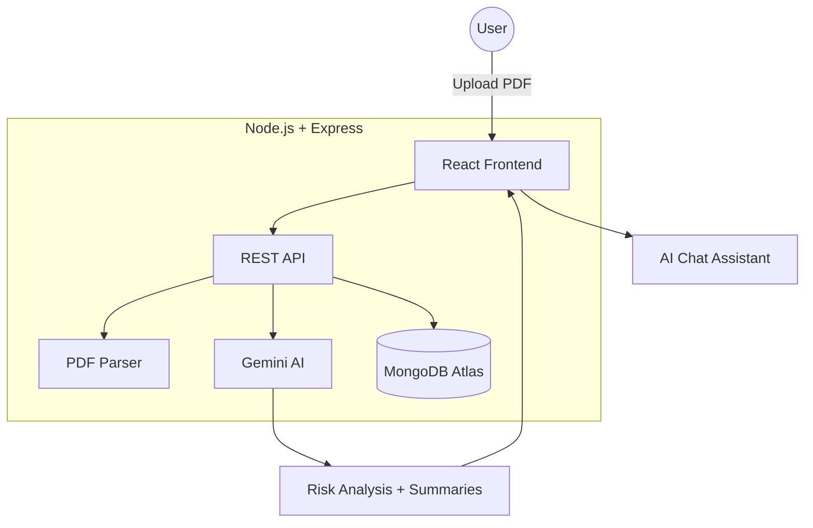

# ⚖️ Clarix — AI-Powered Legal Intelligence Platform

<div align="center">
  

  <p align="center">
    <strong>An AI-powered platform for analyzing legal documents, detecting risks, and simplifying contracts.</strong>
  </p>

  <p align="center">
    <a href="#" target="_blank">
      
    </a>
  </p>
</div>

---

## 🚀 Overview

Clarix is a full-stack AI legal analysis platform designed to simplify complex legal agreements into easy-to-understand insights. Built using **React, Node.js, Express.js, MongoDB, and Gemini AI**, the platform provides intelligent summaries, risk analysis, and contextual AI chat for uploaded legal documents.

---

## ✨ Key Features

* ⚖️ **AI Legal Analysis:** Smart contract understanding using Gemini AI
* 📄 **PDF Processing:** Upload and extract text from legal documents
* ⚠️ **Risk Detection:** Detects indemnification, liability, and hidden clauses
* 📊 **Risk Scoring:** Generates automated legal risk ratings
* 💬 **AI Chat Assistant:** Ask contextual questions about uploaded documents
* 📱 **Responsive UI:** Premium editorial-style interface for all devices

---

## 🛠️ Tech Stack

**Frontend:** React 18, Vite, Vanilla CSS
**Backend:** Node.js, Express.js
**Database:** MongoDB Atlas, Mongoose
**AI Engine:** Google Gemini 1.5 Flash
**File Processing:** Multer, PDF-Parse
**Security:** JWT, Bcrypt.js, Express Rate Limit

---

## 📂 System Architecture



---

## 🔑 Environment Variables

Create a `.env` file in the root directory:

```env
MONGO_URI=your_mongodb_connection
JWT_SECRET=your_secret_key
GEMINI_API_KEY=your_gemini_api_key
```

---

## ⚙️ Installation & Setup

### 1️⃣ Clone Repository

```bash
git clone https://github.com/yourusername/clarix.git
cd clarix
```

### 2️⃣ Install Dependencies

```bash
npm install
```

### 3️⃣ Run Application

```bash
npm run dev
```

---


